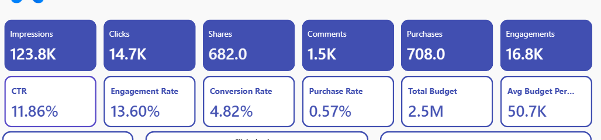
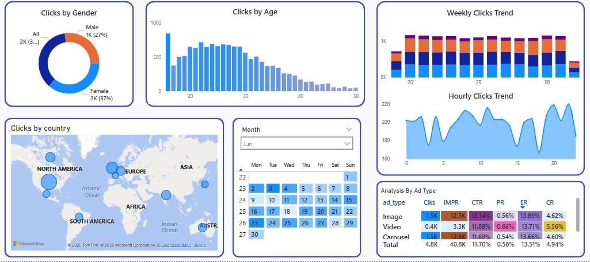
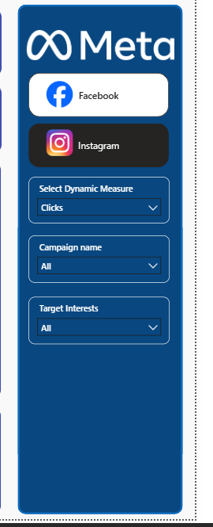

# 📊 Meta Social Media Performance Analysis Dashboard (Power BI)

## 📝 Project Overview
This project is a **Power BI dashboard** created by following an end-to-end tutorial that analyzes **Facebook and Instagram performance data**.  
The dashboard provides insights into engagement, reach, impressions, and overall performance using interactive visuals and filters.

> 🎯 Purpose:  
To demonstrate Power BI skills such as data modeling, DAX calculations, interactive dashboards, and business-oriented insights for a **data analyst portfolio**.

---

## 🛠️ Tools & Technologies
- **Power BI Desktop**
- **Power Query** (Data Cleaning & Transformation)
- **DAX** (Calculated measures & KPIs)
- **Excel / CSV** (Data source – as used in the tutorial)

---

## 📂 Dataset Information
- Social media performance data for:
  - Facebook
  - Instagram
- Metrics include:
  - Likes
  - Comments
  - Shares
  - Reach
  - Impressions
  - Engagement

---

## 📈 Dashboard Features
- KPI cards for quick performance overview
- Platform-wise comparison (Facebook vs Instagram)
- Trend analysis over time
- Interactive slicers and filters
- Clean and business-friendly layout

---

## 🖼️ Dashboard Preview

### 🔹 Overall Dashboard View

---

### 🔹 KPI Summary Section

---

### 🔹 Time-Based Performance Analysis

---

### 🔹 Filters

---

## 🔍 Key Insights
- Identifies which platform performs better based on engagement metrics
- Highlights trends and growth patterns over time
- Helps understand audience interaction behavior
- Supports data-driven decision-making for social media strategy

---

---

## ▶️ How to Use
1. Download the `.pbix` file from this repository
2. Open it using **Power BI Desktop**
3. Explore visuals using slicers and filters
4. Review DAX measures and data model if needed

---

## 🎥 Reference Tutorial
This project is based on the following YouTube tutorial:

🔗 **Power BI Project | Facebook & Instagram Analysis | Real Time Project**  
https://youtu.be/8fe9wENTdtU

---

## 📌 Disclaimer
This project is created **for learning and portfolio purposes only**.  
All credit for the original dashboard idea and dataset structure goes to the tutorial creator.

---

## 🙋 Author
**Lynn Khant Khant**  
Aspiring IT Student | Power BI | SQL | Python  

